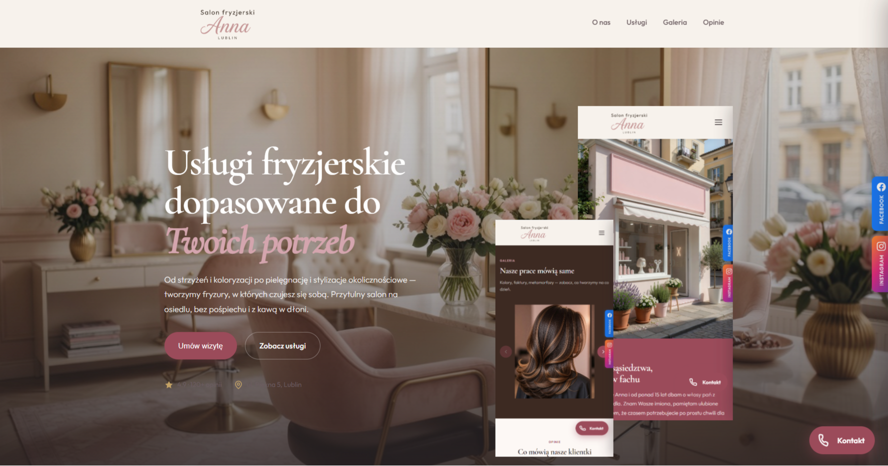

# Salon Anna — Fryzjer Damski | Lublin

**Twój sąsiedzki salon fryzjerski na osiedlu Piękna w Lublinie.**

Profesjonalna pielęgnacja włosów w przyjaznej, domowej atmosferze.  
Strzyżenia, koloryzacje, stylizacje okolicznościowe i zabiegi pielęgnacyjne.

---

## 📍 Lokalizacja

**Salon Anna**  
ul. Piękna 5  
20-861 Lublin

---

## ✨ Co oferujemy

- Strzyżenie damskie i stylizacja
- Koloryzacja i balayage
- Zabiegi pielęgnacyjne (keratyna, botox, olejowanie)
- Fryzury ślubne i okolicznościowe
- Strzyżenie dzieci i nastolatek

---

## 🖥️ Podgląd strony

Strona internetowa została stworzona jako nowoczesna, responsywna wizytówka salonu.

**Link do strony:**  
[[https://twoj-adres-strony.pl](https://salonanna.netlify.app/)]([https://twoj-adres-strony.pl](https://salonanna.netlify.app/))

---

## 🛠️ Technologie

- HTML5 + CSS3
- JavaScript (interaktywne elementy)
- Responsywny design (działa na telefonie, tablecie i komputerze)

---

## 🚀 Jak uruchomić lokalnie

1. Pobierz lub sklonuj repozytorium
2. Otwórz plik `index.html` w przeglądarce

Lub po prostu kliknij dwukrotnie w plik `index.html`.

---

## 👩‍🦰 O salonie

Salon Anna to miejsce stworzone z myślą o kobietach z osiedla.  
Pani Anna od ponad 15 lat zajmuje się fryzjerstwem damskim, dbając nie tylko o włosy, ale też o dobrą atmosferę i indywidualne podejście do każdej klientki.

---

## 📞 Kontakt

- **Telefon:** +48 81 123 45 67
- **Adres:** ul. Piękna 5, 20-861 Lublin
---

## 📄 Licencja

© 2026 Salon Anna. Wszystkie prawa zastrzeżone.
